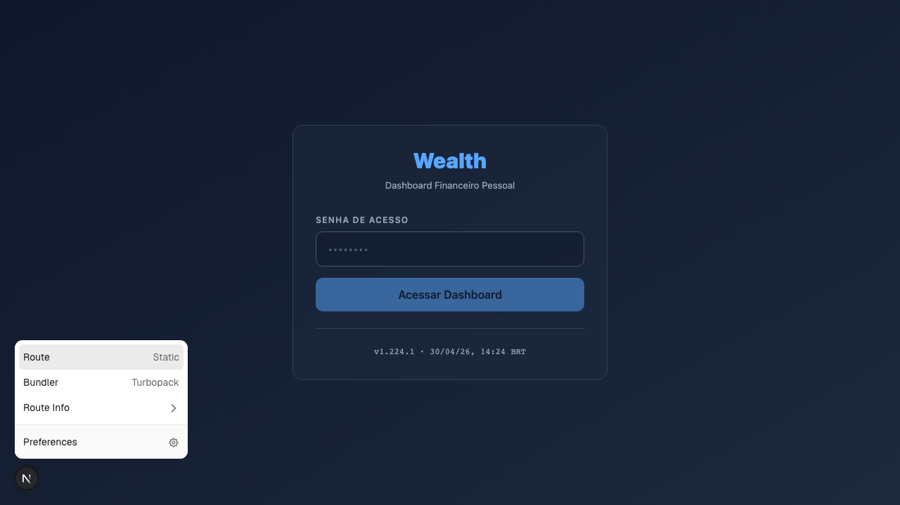

# FR-audit-p2-improvements: P2 Melhorias de Clareza e Completude — Auditoria Visual Playwright 2026-04-30

## Metadados

| Campo | Valor |
|-------|-------|
| **ID** | FR-audit-p2-improvements |
| **Dono** | Dev |
| **Status** | ✅ Concluído — todos os 40 itens endereçados (2026-04-30) |
| **Prioridade** | 🟡 P2 — Melhorias de Clareza e Completude |
| **Criado em** | 2026-04-30 |
| **Origem** | HD-visual-audit-playwright — Fase 3 (síntese) |
| **Screenshots** | `agentes/issues/screenshots/visual-audit-2026-04-30/` |

---

## Contexto

40 melhorias identificadas na auditoria visual de 2026-04-30, agrupadas em 3 clusters: Labels/Framing, Métricas Analíticas, e UX/Ordem. Nenhum quebra decisões críticas, mas o acúmulo degrada a qualidade analítica do dashboard.

**Convenção de status:** `[ ]` = pendente, `[~]` = em progresso, `[x]` = concluído.

Screenshots de referência:

---

## Cluster A — Labels e Framing Incorretos (não dado errado, mas apresentação enganosa)

| # | Aba | Finding | Arquivo / Linha | Fix |
|---|-----|---------|-----------------|-----|
| A1 | NOW | IPS Summary: "Equity alvo" mostra valor potencialmente errado | `page.tsx:776` | Verificar se `equityAlvo * 100` = 79% ou se há bug de cálculo |
| A2 | NOW | ETFFactorComposition colapsa RMW+CMA em "Quality" — perde granularidade fatorial | `ETFFactorComposition.tsx` | Separar RMW e CMA como fatores distintos (Quality of Profitability vs Investment) |
| A3 | PORTFOLIO | Drift labels não esclarecem escopo "intra-equity" vs "total portfolio" | `RebalancingStatus.tsx` | Adicionar subtitle "% do portfolio total" em cada linha de drift |
| A4 | BACKTEST | UCITS warning pode ser falso positivo para AVGS (estrutura diferente do SWRD) | Backtest page | Verificar se warning checa ticker específico ou aplica regra genérica; AVGS pode não ter limitação UCITS |
| A5 | FIRE | FireSpectrumWidget: `diegoTarget = 10_000_000` hardcoded | `FireSpectrumWidget.tsx` | Usar `data.meta_fire_brl` ou `config.py.META_FIRE_BRL` |
| A6 | FIRE | SoRR guardrail values hardcoded em vez de vir do config | `SequenceOfReturnsRisk.tsx` | Usar `data.guardrails.*` do data.json |
| A7 | FIRE | Barras de progresso de patrimônio duplicadas | FIRE page | Identificar qual é redundante e remover |
| A8 | FIRE | Hero banner sem patrimônio atual para contexto | FIRE page hero | Adicionar patrimônio atual como subtítulo ou linha de contexto no hero |

---

## Cluster B — Métricas Analíticas Faltando

| # | Aba | Finding | Arquivo / Linha | Fix |
|---|-----|---------|-----------------|-----|
| B1 | PERF | Alpha cards sem Tracking Error (TE) e Information Ratio (IR) | Performance page | Calcular TE = std(retorno_alvo - retorno_swrd); IR = alpha/TE; adicionar cards |
| B2 | PERF | Rolling 12m alpha chart sem linha de referência +5pp (target do factor premium) | `AlphaVsSWRDChart.tsx` | Adicionar markLine horizontal em +5pp com label "target premium" |
| B3 | PERF | Tabela anual tem VWRA mas falta coluna SWRD como benchmark | Performance page | SWRD é o benchmark primário; VWRA pode ser secundário. Adicionar coluna SWRD |
| B4 | PERF | "Premissas vs Realizado" com período de benchmark curto demais para significância estatística | Performance page | Adicionar nota de cuidado: "N = X anos — insuficiente para significância estatística (mínimo 10 anos)" |
| B5 | PORTFOLIO | Factor Value Spread: falta percentil de RMW (profitability spread) | Factor value spread widget | Adicionar percentil RMW junto com HML e SMB |
| B6 | PORTFOLIO | Sem widgets de loading SMB/HML/RMW com thresholds por ETF | Portfolio page | Painel de factor loadings com barra visual e threshold "acima/abaixo do neutro" |
| B7 | PORTFOLIO | Factor drought counter usa aproximação imprecisa vs valor do pipeline | Drought counter widget | Usar valor direto do pipeline em vez de aproximação calculada no frontend |
| B8 | PORTFOLIO | Factor drought counter não monitora AVEM (só AVGS vs SWRD) | Drought counter widget | Adicionar AVEM ao monitoramento de factor drought |
| B9 | BACKTEST | Sem backtest com bond tent portfolio (equity reduzindo conforme aproxima FIRE) | Backtest page | Adicionar preset "Bond Tent" com equity reduzindo de 79% → 40% nos 5 anos pré-FIRE |
| B10 | BACKTEST | Drawdown chart não destaca janelas SoRR-relevantes (primeiros 5 anos pós-FIRE) | Backtest page | Adicionar band/highlight nos primeiros N anos de simulação de aposentadoria |
| B11 | BACKTEST | Shadow portfolio sem decomposição de atribuição RF vs equity | Backtest page | Adicionar barra de atribuição: quanto do retorno veio de equity vs RF em cada período |
| B12 | SIMULATORS | FIRE simulator: RF return não ajustável pelo usuário | Simulators page | Adicionar slider de retorno RF (IPCA + spread) para sensibilidade no simulator |
| B13 | SIMULATORS | Sem What-If para realocação Renda+ 2065 → IPCA+ de longo prazo | Simulators page | Adicionar cenário de substituição de Renda+ por IPCA+2050 com impacto em duration e retorno |
| B14 | SIMULATORS | Cascata não mostra taxa atual vs piso por instrumento | Cascata widget | Adicionar linha "taxa atual: X% / piso: Y% / gap: +Z%" para cada instrumento RF |

---

## Cluster C — UX, Ordem e Visibilidade

| # | Aba | Finding | Arquivo / Linha | Fix |
|---|-----|---------|-----------------|-----|
| C1 | PERF | Expected Return Waterfall collapsed por default — deveria estar aberto | Performance page | `defaultOpen={true}` no CollapsibleSection do waterfall |
| C2 | PORTFOLIO | ETFRegionComposition default em tab SWRD, deveria ser AVGS | `ETFRegionComposition.tsx` | Mudar tab default para AVGS (é o mais diferenciado — EM/DM mix, não só global) |
| C3 | PORTFOLIO | Sem painel de dilution progress (transitório pós-JPGL) | Portfolio page | Mostrar quanto ainda está em posição transitória (se houver) e timeline para atingir target |
| C4 | NOW | Sem semáforo de factor drought no NOW | NOW page | Mini semáforo "Factor Drought: X meses" com verde/amarelo/vermelho por threshold |
| C5 | NOW | Sem factor loadings consolidados do portfolio no NOW | NOW page | Card compacto com loadings agregados SMB/HML/RMW do portfolio total |
| C6 | NOW | DecisaoDoMes sem contexto fatorial da decisão | `DecisaoDoMes.tsx` | Adicionar linha: "SWRD = market neutral; AVGS/AVEM = tilt value+profitability" |
| C7 | FIRE | P(quality) sem interpretação de threshold | FIRE page | Adicionar tooltip ou nota: "P(quality) > 70% = boa distribuição de retornos; < 50% = sequência preocupante" |
| C8 | FIRE | Capital humano Katia floor não visível no NOW | NOW page | Mini card ou linha na seção de patrimônio: "Cap. humano Katia: R$XXXk/ano INSS" |
| C9 | FIRE | Cenário casal P(FIRE casal) ausente do NOW | NOW page | Adicionar P(FIRE casal) como item no KpiHero ou seção de cenários FIRE |
| C10 | FIRE | Ordem das seções na aba FIRE cria hierarquia confusa | FIRE page | Hero → Trilha → Cenários → Bond Pool → SoRR → Spectrum → Coast. Revisar ordem atual |
| C11 | FIRE | IPS Summary sem R$8.33M gatilho de patrimônio explícito | `page.tsx` IPS Summary | Adicionar linha "Gatilho FIRE: R$8.33M" (= meta_fire_brl × fator_segurança) |
| C12 | FIRE | Sem projeção de FIRE date aspiracional por SWR variável | FIRE page | Adicionar linha "Se SWR = 3.5%: FIRE em YYYY; se SWR = 4%: FIRE em YYYY" |
| C13 | FIRE | Sem distribuição subjetiva de FIRE date | FIRE page | Histograma de probabilidade de FIRE por ano (ex: P(FIRE 2038) = 20%, 2039 = 35%...) |
| C14 | WITHDRAW | Cortes de guardrail sem especificar categoria de origem | Withdraw page | "Se guardrail atingido: reduzir lifestyle R$Xk/ano (não saúde)" |
| C15 | WITHDRAW | Draw sequence (bond pool → equity) não visível na aba Withdraw | Withdraw page | Adicionar diagrama visual simples: Ano 1-6: Bond Pool → Ano 7+: Equity (SWR) |

---

## Sugestão de Sprint

Para atacar este backlog de forma eficiente, sugerimos agrupamentos por sprint:

**Sprint Alpha (clareza fatorial — 1 dia):** A2, B1, B2, B3, B5, B6, B7, B8, C4, C5, C6  
**Sprint FIRE UX (1 dia):** A5, A6, A7, A8, C7, C9, C10, C11, C12, C14, C15  
**Sprint Portfolio (0.5 dia):** A3, A4, C2, C3  
**Sprint Perf/Backtest (1 dia):** B4, B9, B10, B11, C1  
**Sprint Simulators (0.5 dia):** B12, B13, B14  

---

## Checklist de Execução

### Sprint Alpha — Clareza Fatorial ✅ 2026-04-30
- [x] A2 — ETFFactorComposition: RMW/CMA separados (granularidade fatorial)
- [x] B1 — Tracking Error + Information Ratio cards na aba Performance
- [x] B2 — Rolling alpha chart: markLine +5pp "target premium"
- [x] B3 — Tabela anual: coluna SWRD como benchmark
- [x] B5 — Factor Value Spread: percentil RMW adicionado
- [x] B6 — Factor loadings por ETF com barra visual e threshold
- [x] B7 — Factor drought counter: usa valor direto do pipeline
- [x] B8 — Factor drought counter: inclui AVEM no monitoramento
- [x] C4 — NOW: semáforo de factor drought (verde/amarelo/vermelho)
- [x] C5 — NOW: card compacto com loadings agregados SMB/HML/RMW
- [x] C6 — DecisaoDoMes: contexto fatorial por ETF ("SWRD = market neutral...")

### Sprint FIRE UX ✅ 2026-04-30
- [x] A5 — FireSpectrumWidget: `diegoTarget` via `premissas.patrimonio_gatilho` (não hardcode)
- [x] A8 — Hero FIRE: patrimônio atual como subtítulo de contexto
- [x] C7 — P(quality): tooltip com interpretação de threshold (>70%/>50%)
- [x] C9 — NOW: strip P(FIRE casal) quando disponível no pipeline
- [x] C11 — IPS Summary: linha "Gatilho FIRE: R$X" via `premissas.patrimonio_gatilho`
- [x] C12 — FIRE: tabela de projeção de FIRE date por SWR variável (2.5–4.0%)
- [x] C14 — Withdraw: guardrail cut category ("recai sobre lifestyle, não saúde")
- [x] C15 — Withdraw: Draw Sequence Diagram (Bond Pool → Equity, anos 0-7 vs 7+)

### Sprint Portfolio + Simulators ✅ 2026-04-30
- [x] A1 — Verificado: `equityAlvo = SWRD(0.395)+AVGS(0.237)+AVEM(0.158) = 0.79 = 79%` ✓ sem bug
- [x] A3 — Verificado: já tinha subtitle "% do portfolio total" (linha 89 RebalancingStatus.tsx)
- [x] A4 — Verificado: sem UCITS warning component — só texto informativo em caption
- [x] A6 — SoRR: `pisoEssencial` usa prop `gastoPiso` (data.gasto_piso=180k) em vez de 184k hardcoded
- [x] B4 — PremisesTable: nota "⚠ N = X anos — insuficiente para significância" dinâmica via periodo_anos
- [x] B12 — Verificado: já implementado como G12 (ipcaTaxa slider no FireSimuladorSection)
- [x] B14 — CascadeSection: linha "Taxa: IPCA+X% · piso Y% · gap ±Zpp" em IPCA+Longo e Renda+
- [x] C1 — ExpectedReturnWaterfall: defaultOpen=true (era false)
- [x] C2 — ETFRegionComposition: tab default → AVGS (era SWRD)
- [x] C3 — N/A: JPGL não está mais em posicoes — transitório encerrado

### Sprint Final ✅ 2026-04-30
- [x] A7 — FIRE: barra de progresso duplicada removida do Gap G (KpiHero já mostra %; Gap G mantém R$ absolutos)
- [x] B9 — Backtest: BondTentAnalysisSection — tent size (39% patrimônio), glide path 2026–2040, gap RF vs bond pool atual
- [x] B10 — Backtest: drawdown_extended.periods populado no pipeline — 4 períodos (real, medium, long, academic)
- [x] B13 — Simulators: RendaVsIpcaDuracaoSection — comparação Renda+2065 vs IPCA+2050 (duration, taxa, spread, bond pool impact)
- [x] C10 — FIRE: section-scenario-compare extraída do aninhamento e posicionada antes de Coast FIRE + FIRE Spectrum
- [x] C13 — FIRE: histograma P(FIRE date) — barras marginais por ano alvo usando fire_matrix.by_profile + earliest_fire

- [x] B11 — Backtest: TimelineAttributionChart — stacked bar RF/equity/FX por ano (timeline_attribution existente)
- [x] C8 — NOW: mini card "Cap. Humano Katia" — INSS R$93.6k/ano, PGBL R$490k, custo solo R$160k/ano
